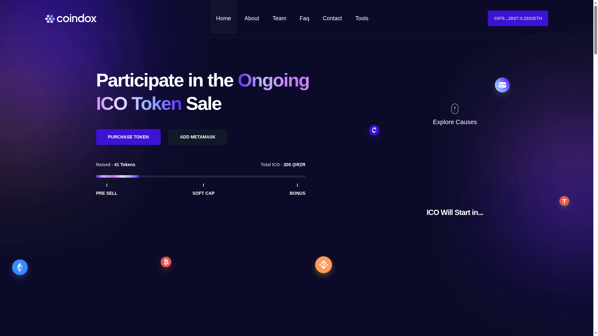
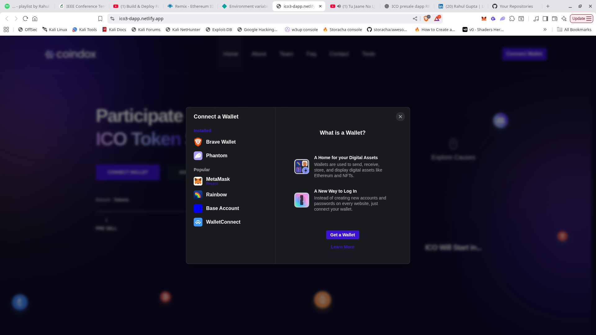
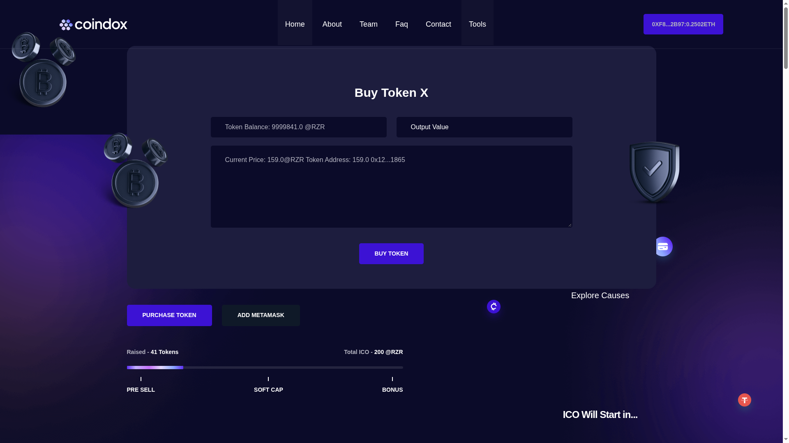
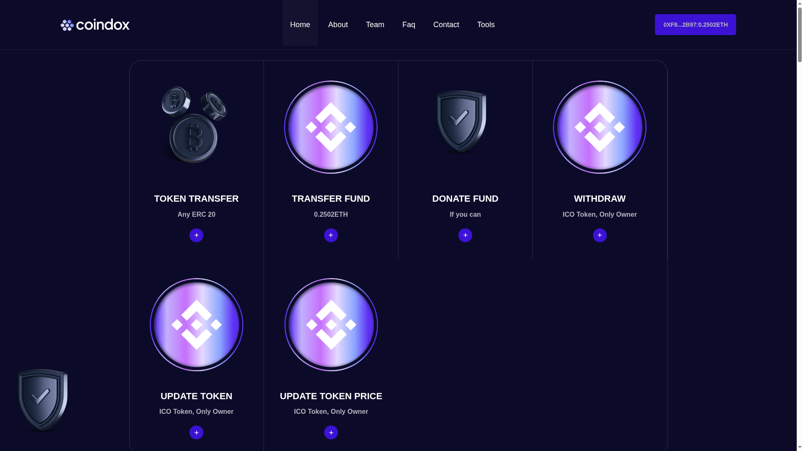

  
  
  
  
  

# 🚀 ICO Presale DApp (Decentralized Token Sale Platform)

  <strong>Trustless • Secure • On-chain Fundraising</strong>

  A production-ready <strong>ICO Presale DApp</strong> enabling users to purchase ERC-20 tokens directly from their crypto wallets. 
  Built with modern Web3 technologies to ensure transparency, immutability, and owner-controlled token distribution.

  🔗 <a href="https://ico3-dapp.netlify.app/">Live Demo</a> •
  🌐 Sepolia Testnet •
  🧠 Smart Contract Powered

---

💰 **A secure, transparent, and fully decentralized token presale platform!** 💰

A modern **ICO Presale DApp** that enables users to participate in token sales directly from their crypto wallets.  
This platform ensures **trustless transactions**, **real-time transparency**, and **full owner control** without intermediaries.

💡 **What makes this powerful?**  
Unlike traditional fundraising platforms, this DApp runs entirely on smart contracts — ensuring **immutability**, **on-chain verification**, and **secure token distribution**.

---

## 📸 Application Screenshots

| Landing Page | Wallet Connection |
|-------------|------------------|
|  |  |

| Buy Tokens | Admin / Owner Panel |
|-----------|--------------------|
|  |  |

> 📌 All screenshots are located inside the `images/` directory.

---

## 🚀 Current Status

✅ **Sepolia Testnet** – Fully deployed & tested  
🔄 **Polygon Mainnet** – Coming very soon  
🔄 **Mainnet Ready UI** – Minor optimizations pending  

---

## ✨ Key Features

- 🔐 **Wallet-Based Authentication** (MetaMask & injected wallets)
- 💰 **ETH to Token Purchase**
- 📊 **Live Presale Statistics**
- 👑 **Owner/Admin Dashboard**
- 🔁 **Token & ETH Transfers**
- 🧾 **Fully On-chain Transactions**
- ⚡ **Fast & Responsive UI**
- 🌍 **Decentralized & Trustless**

---

## 🔑 Smart Contract Details

- **Token Standard**: ERC-20  
- **Network**: Sepolia Testnet  

### Core Functions
- Buy Tokens  
- Withdraw Raised Funds  
- Transfer Tokens  
- Update Token Price  
- Ownership & Access Control  

---

## 👑 Admin Capabilities

- Update token price in real-time  
- Withdraw collected ETH  
- Transfer tokens to users  
- Manage ICO parameters  
- Monitor total sold tokens  

---

## 🧱 Tech Stack

### Smart Contracts
- Solidity  
- ERC-20 Standard  
- Sepolia Testnet  

### Frontend
- React (Vite / Next.js)
- Tailwind CSS
- Ethers.js
- Web3.js
- RainbowKit
- Wagmi
- React Hot Toast

---

## 📂 Project Structure

ico-presale-dapp/
├── components/
├── context/
├── pages/
├── styles/
├── images/
├── constants/
├── utils/
├── README.md
└── package.json

---

## 🔒 Security Notes

- Wallet-based authentication (no passwords)
- All transactions verified on-chain
- No private keys stored on frontend
- Owner-only functions protected by access control

---

## 🗺️ Roadmap

**Phase 1 (Completed)** ✅ Sepolia deployment & testing  
**Phase 2 (Next)** 🔄 Polygon Mainnet launch  
**Phase 3 (Future)** 📊 Analytics dashboard, vesting, multi-chain support  

---

## 💡 Why This Project Matters

🎯 **Trustless Fundraising** – No centralized authority  
🏗️ **Production-Ready Architecture** – Clean, modular code  
🚀 **Real Deployment** – Live and functional DApp  

---

## 👨‍💻 Author

**Rahul Kumar Gupta**  
Blockchain Developer  

- GitHub: https://github.com/rahul-0407  
- LinkedIn: https://www.linkedin.com/in/rahul-gupta-0407t/

---

## 📜 License

This project is licensed under the **MIT License**.

---

⭐ If you find this project useful, don’t forget to **star the repository**!

---

**Building the future of decentralized fundraising — one smart contract at a time.** 🚀
